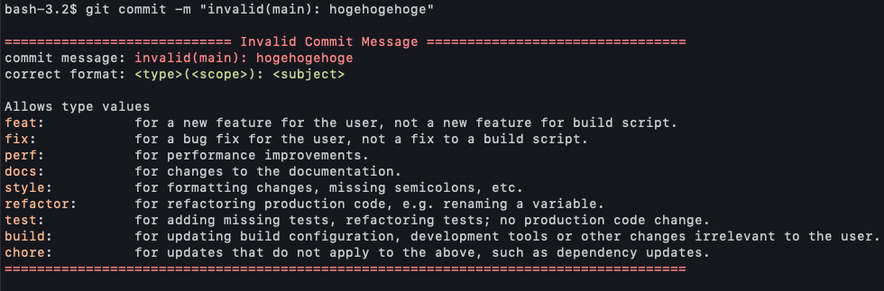

# go-commitlinter

go-commitlinter is simple commit message linter.



## Quick Start
```
go install github.com/masahiro331/go-commitlinter@0.0.1
echo "go-commitlinter" >> .git/hooks/commit-msg
chmod 755 .git/hooks/commit-msg
```

## Description

The go-commitlinter will detect and fail a commit message that is not in the following format.

```
<type>(<scope>): <subject>
```

The `type` and `scope` should always be lowercase as shown below.  
The `<scope>` can be empty (e.g. if the change is a global or difficult to assign to a single component), in which case the parentheses are omitted.

**Allowed `<type>` values:**
  - **feat** for a new feature for the user, not a new feature for build script.
  - **fix** for a bug fix for the user, not a fix to a build script.
  - **perf** for performance improvements.
  - **docs** for changes to the documentation.
  - **style** for formatting changes, missing semicolons, etc.
  - **refactor** for refactoring production code, e.g. renaming a variable.
  - **test** for adding missing tests, refactoring tests; no production code change.
  - **build** for updating build configuration, development tools or other changes irrelevant to the user.
  - **chore** for updates that do not apply to the above, such as dependency updates.

**`<scope>` example:**
  - parser
  - controller
  - some `package namespace`
  - etc...
